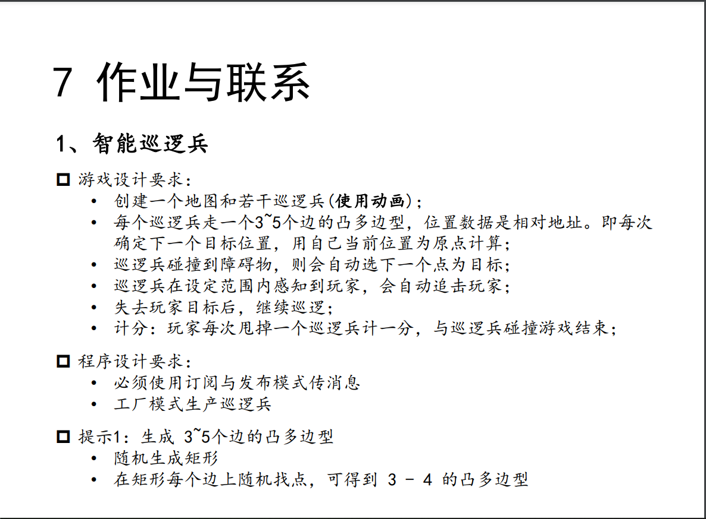
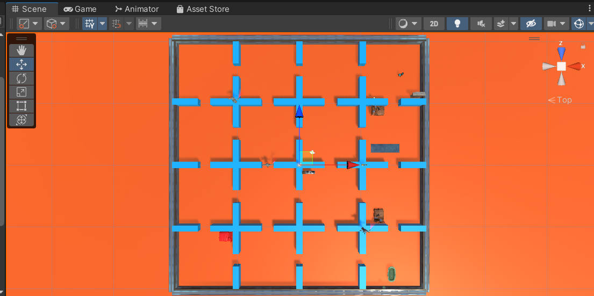
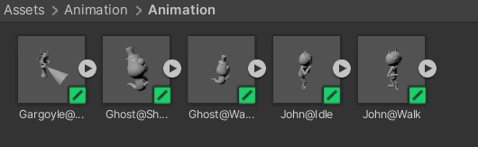
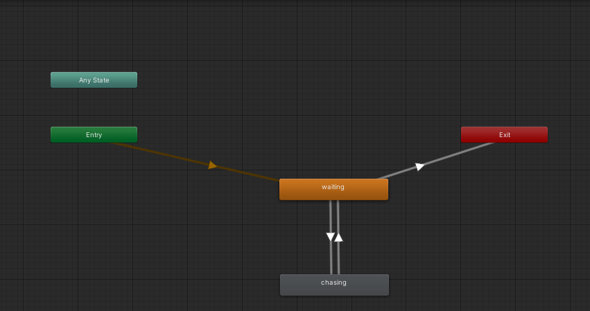
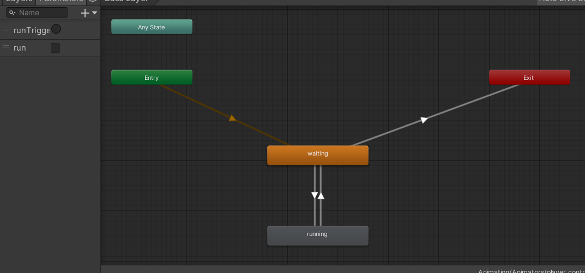
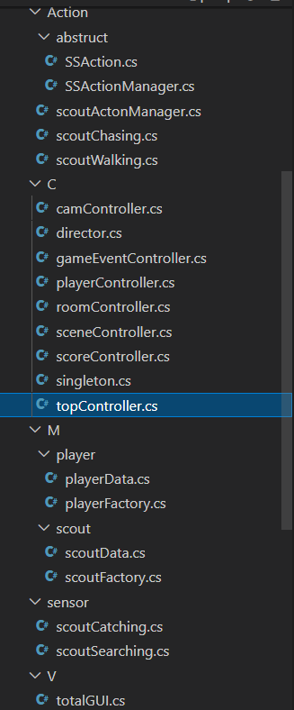

# unity作业5-智能巡逻兵

[演示视频链接](https://www.bilibili.com/video/BV1bG411w7sx)

部分地图构建与实现参考：[用Unity3D实现【智能巡逻兵】](https://wondrouswisdomcard.gitee.io/posts/unity3d4/)

## 题目



## 游戏说明

这是一个由unity实现的智能巡逻兵的游戏，玩家需要在给定的地图中穿梭，并躲避地图中巡逻兵的追击。地图中有16个房间，每个房间中的巡逻兵以及障碍物均不同。游戏没有时间限制，但一旦巡逻兵接触到玩家，视为玩家被巡逻兵抓获，游戏结束。当玩家与巡逻兵距离较近时，巡逻兵将会开始追击玩家，当玩家与巡逻兵之间距离拉开时则巡逻兵放弃追踪，玩家甩开一个巡逻兵积一分。

## 实现思路

### asset store资源导入

这里除了导入了之前用过的fantasy skybox free之外，我还使用了asset store中的3D Beginner: Tutorial Resources这个资源。这里面有一些ghost的资源，有提前制作好的动画可供使用。除此以外，还有一些可以用于场景布置的预制品可供使用。

### 地图构建

地图的整体构架如下。



在一个plane上用四周围墙围起来一个40*40大小的地图，共分为16个小房间，每个房间大小为10 * 10。使用3D Beginner中提供的一些物品预制来进行装饰和提供障碍物。当然这里做的比较一般。

### animator构建

需要为巡逻兵（scout）和玩家（player）构建animator。

3D Beginner在asset/Animation中提供了很多单独动画，可以用它们来构建动画。



scout和player的animator如下。

scout



player



### 代码结构

代码部分，总共有五个大模块：M、V、C、sensor和Action。其中，MVC模块是MVC架构的部分，Action模块负责scout的动作，sensor是传感器类，用于感知scout发现和scout碰撞事件并将信息传回控制器中。

代码结构如下。



## 代码细节

### Action模块

#### scoutChasing类与scoutWalking类

这两个类是抽象类SSAction类的子类，分别负责scout在追踪状态和闲置状态下的运动。

scoutChasing

```csharp
using System.Collections;
using System.Collections.Generic;
using UnityEngine;

public class scoutChasing : SSAction{
    public float v;
    public GameObject scout;
    public GameObject player;
    public scoutData scoutD;
    public playerData playerD;
    public static scoutChasing getAction(GameObject player, GameObject scout){
        scoutChasing ac = CreateInstance<scoutChasing>();
        ac.player = player;
        ac.scout = scout;
        return ac;
    }
    public override void Start(){
        scoutD = scout.GetComponent<scoutData>();
        v = 0.8f;
        playerD = player.GetComponent<playerData>();
    }
    public override void Update(){
        bool outofRoom = (scoutD.roomID != playerD.roomID);
        if(scoutD.running && (!scoutD.found || outofRoom || scoutD.needTurn || playerD.getCatched)){
            Debug.Log("giveup"+scoutD.needTurn);
            this.destroy = true;
            this.enable = false;
            this.gameObject.GetComponent<scoutData>().running = false;
            singleton<gameEventController>.Instance.runAway(this.gameObject);
        }
        else{
            transform.LookAt(player.transform.position);
            transform.position = Vector3.MoveTowards(this.transform.position, player.transform.position, v*Time.deltaTime);
        }
    }
}

```

scoutWalking

```csharp
using System.Collections;
using System.Collections.Generic;
using UnityEngine;

public class scoutWalking : SSAction{
    public float v;
    bool changeDir;
    public float posX;
    public float posZ;
    public GameObject scout;
    public GameObject player;
    public scoutData scoutD;
    public playerData playerD;
    public static scoutWalking getAction(GameObject player, GameObject scout){
        scoutWalking ac = CreateInstance<scoutWalking>();
        ac.player = player;
        ac.scout = scout;
        ac.posX = scout.transform.position.x;
        ac.posZ = scout.transform.position.z;
        return ac;
    }

    // Start is called before the first frame update
    public override void Start(){
        v = 0.5f;
        changeDir = true;
        scoutD = scout.GetComponent<scoutData>();
        playerD = player.GetComponent<playerData>();
    }

    // Update is called once per frame
    public override void Update(){
        bool inRoom = (scoutD.roomID == playerD.roomID);
        if(!scoutD.running && (scoutD.found && inRoom && !scoutD.needTurn && !playerD.getCatched)){
            Debug.Log("following");
            this.destroy = true;
            this.enable = false;
            this.gameObject.GetComponent<scoutData>().running = true;
            singleton<gameEventController>.Instance.chasingPlayer(this.gameObject);
        }
        else{
            walk();
        }
    }
    void walk(){
        if(changeDir){
            posX = this.transform.position.x + Random.Range(-3F, 3F);
            posZ = this.transform.position.z + Random.Range(-3F, 3F);
            this.transform.LookAt(new Vector3(posX,0,posZ));
            this.gameObject.GetComponent<scoutData>().needTurn = false;
            changeDir = false;
        }

        if(this.gameObject.GetComponent<scoutData>().needTurn){
            // Debug.Log("turning around");
            clashTurn();
        }
        else if(Vector3.Distance(transform.position, new Vector3(posX, 0, posZ)) <= 0.1f){
            changeDir = true;
        }
        else{
            this.transform.Translate(0,0,Time.deltaTime*v);
        }
    }
    void clashTurn(){
        this.transform.Rotate(Vector3.up,Random.Range(120, 180));
        GameObject temp = new GameObject();
        temp.transform.position = this.transform.position;
        temp.transform.rotation = this.transform.rotation;
        temp.transform.Translate(0, 0, Random.Range(0.5f, 2.0f));

        posX = temp.transform.position.x;
        posZ = temp.transform.position.z;
        this.transform.LookAt(new Vector3(posX, 0, posZ));
        Destroy(temp);
        this.gameObject.GetComponent<scoutData>().needTurn = false;
    }
}

```

scoutActonManager类是抽象类SSActionManager类的子类,负责管理scoutChasing和scoutWalking类，根据scout的状态为scout分别挂载不同的运动类。

```csharp
using System.Collections;
using System.Collections.Generic;
using UnityEngine;

public class scoutActonManager : SSActionManager{
    public scoutChasing chasing;
    public scoutWalking walking;
    public void walk(GameObject player,GameObject scout){
        // Debug.Log("start walking");
        walking = scoutWalking.getAction(player,scout);
        RunSSAction(scout,walking);
    }
    public void chase(GameObject player,GameObject scout){
        chasing = scoutChasing.getAction(player,scout);
        RunSSAction(scout,chasing);
    }
    public void stop(){
        DestroyAll();
    }
}
```

### Controller（C）模块

controller模块中，定义了topController和之下的多个controller，包括camController，gameEventController，playerController，roomController，scoreController等控制器模块。

#### camController

用于控制摄像机追踪玩家角色。

```csharp
using System.Collections;
using System.Collections.Generic;
using UnityEngine;

public class camController : MonoBehaviour{		
    private Vector3 targetPos;
    Transform camTarget;
    public GameObject player;
    // Start is called before the first frame update
    void Start(){
        
    }
    /// <summary>
    /// LateUpdate is called every frame, if the Behaviour is enabled.
    /// It is called after all Update functions have been called.
    /// </summary>
    void LateUpdate(){
        camTarget = player.transform.GetChild(2);
        targetPos = camTarget.position + Vector3.up * 3.0f - camTarget.forward * 3.0f;
        transform.position = Vector3.Lerp(transform.position, targetPos, Time.deltaTime * 2.0f);
        //指定摄像机的指定角度
        transform.LookAt(camTarget);
    }
}

```

#### gameEventController

订阅和发布的一部分，用于接收sensor的信息，并通过delegate机制传到订阅者topController中，执行相应操作。

```csharp
using System.Collections;
using System.Collections.Generic;
using UnityEngine;

public class gameEventController : MonoBehaviour{
    //玩家摆脱巡逻兵
    public delegate void runAwayEvent(GameObject ghost);
    public static event runAwayEvent runaway;
    //玩家被发现
    public delegate void ChasingEvent(GameObject scout);
    public static event ChasingEvent chasing;
    //玩家被捕获
    public delegate void CatchedEvent();
    public static event CatchedEvent catched;

    public void runAway(GameObject scout){
        if(runaway != null){
            runaway(scout);
        }
    }
    public void chasingPlayer(GameObject scout){
        if (chasing != null){
            chasing(scout);
        }
    }

    public void playerCatched(){
        if(catched != null){
            catched();
        }
    }
}

```

#### playerController

用于实现玩家对角色的控制。a/s/d用于左转/后转/右转，而左箭头/右箭头用于左右小幅度转动。空格用于切换停止/运动状态。

```csharp
using System.Collections;
using System.Collections.Generic;
using UnityEngine;

public class playerController : MonoBehaviour{
    public Animator ani;
    private bool run;
    void Start(){
        ani = GetComponent<Animator>();
        run = true;
    }

    void Update(){
        //空格来切换静止/运动状态，asd用于向左/向后/向右转，左右小箭头用于小幅度(pi/6)转动
        if(Input.GetKeyDown(KeyCode.Space)){
            ani.SetBool("run",run);
            run = !run;
        }
        else if(Input.GetKeyDown("a")){
            transform.Rotate(0,-90.0f,0);
        }
        else if(Input.GetKeyDown("s")){
            transform.Rotate(0,180.0f,0);
        }
        else if(Input.GetKeyDown("d")){
            transform.Rotate(0,90.0f,0);
        }
        else if(Input.GetKeyDown(KeyCode.LeftArrow)){
            transform.Rotate(0,-30.0f,0);
        }
        else if(Input.GetKeyDown(KeyCode.RightArrow)){
            transform.Rotate(0,30.0f,0);
        }
    }
}

```

#### roomController

用于更新用户所处的房间号，并将scout限制在自己的房间中。

```csharp
using System.Collections;
using System.Collections.Generic;
using UnityEngine;

public class roomController : MonoBehaviour{
    topController topcontroller;
    float[] X = {-15.0f,-5.0f,5.0f,15.0f};
    float[] Z = {15.0f,5.0f,-5.0f,-15.0f};
    float range = 4.0f;
    int cnt = 0;
    void Update(){
        topcontroller = director.GetSingleton().currentSceneController as topController;
        GameObject player = topcontroller.player;
        float x = player.transform.position.x;
        float z = player.transform.position.z;
        player.GetComponent<playerData>().roomID = (int)(((x+20) / 10) + 1) + (int)(4-(z+20) / 10) * 4;
        cnt++;
        if(cnt == 30){
            keepinRoom();
            cnt = 0;
        }
    }
    void keepinRoom() {
        for(int i = 0 ; i < topcontroller.scouts.Count ; i++) {
            GameObject scout = topcontroller.scouts[i];
            Vector3 pos = scout.transform.position;
            //房间对应的行数和列数
            int roomID = scout.GetComponent<scoutData>().roomID;
            int row = (roomID-1) % 4;
            int col = (roomID-1) / 4;
            if(pos.x < X[row] - range || pos.x > X[row] + range || pos.z < Z[col] - range || pos.z > Z[col] + range){
                //将巡逻兵离开房间的操作视为一次碰撞
                scout.GetComponent<scoutData>().needTurn = true;
            }
        }
    }
}
 
```

#### scoreController

用于累计分数。

```csharp
using System.Collections;
using System.Collections.Generic;
using UnityEngine;

public class scoreController : MonoBehaviour{
    public int score = 0;
    // Start is called before the first frame update
    void Start(){
        
    }
    public void add(int i = 1){
        score += i;
    }
    public void set(int target = 0){
        score = target;
    }
}
```

#### topController

总控制器，挂载在场景中的scriptCarrier（为了挂载脚本而放入场景中的一个虚拟物体）上，控制整体。

```csharp
using System.Collections;
using System.Collections.Generic;
using UnityEngine;

public class topController : MonoBehaviour,sceneController{
    public List<GameObject> scouts = new List<GameObject>();
    public GameObject player;
    public totalGUI totalgui;
    public scoutFactory scoutfactory;
    public playerFactory playerfactory;
    public gameEventController gameeventcontroller;
    public scoutActonManager scoutactionManager;
    public roomController roomcontroller;
    public scoreController scorecontroller;
    public camController camcontroller;
    int time;
    int cnt;
    // Start is called before the first frame update
    void Start(){
        Application.targetFrameRate = 60;
        time = cnt = 0;
        director.GetSingleton().currentSceneController = this;
        gameObject.AddComponent<scoutFactory>();
        scoutfactory = singleton<scoutFactory>.Instance;

        gameObject.AddComponent<playerFactory>();
        playerfactory = singleton<playerFactory>.Instance;
        load();
        gameObject.AddComponent<scoutActonManager>();
        scoutactionManager = singleton<scoutActonManager>.Instance;
        gameObject.AddComponent<gameEventController>();
        gameeventcontroller = singleton<gameEventController>.Instance;

        gameObject.AddComponent<totalGUI>();
        totalgui = singleton<totalGUI>.Instance;

        gameObject.AddComponent<roomController>();
        roomcontroller = singleton<roomController>.Instance;

        gameObject.AddComponent<scoreController>();
        scorecontroller = singleton<scoreController>.Instance;

        Camera.main.GetComponent<camController>().player = player;
        for(int j = 0;j < scouts.Count;++j){
            scoutactionManager.walk(player,scouts[j]);
        }
    }

    // Update is called once per frame
    void Update(){
        if(totalgui.start && !totalgui.failed){
            ++cnt;
            if(cnt == 60){
                cnt = 0;
                ++time;
            }
        }
        totalgui.UpdateoutputText(scorecontroller.score,time);
    }
    //load scene
    public void load(){
        Debug.Log("loading");
        player = playerfactory.getPlayer();
        Debug.Log("player ready");
        scouts.Clear();
        for(int j = 1;j <= 16;++j){
            Debug.Log("add");
            if(j != 10){
                GameObject scout1 = scoutfactory.getScout(j,2,2);
                scouts.Add(scout1);
                GameObject scout2 = scoutfactory.getScout(j,-3,-2);
                scouts.Add(scout2);
                GameObject scout3 = scoutfactory.getScout(j,1,-3);
                scouts.Add(scout3);
            }
            if(j == 3 || j == 7 || j == 12 || j == 16){
                GameObject scout4 = scoutfactory.getScout(j,1,2);
                scouts.Add(scout4);
                GameObject scout5 = scoutfactory.getScout(j,3,2);
                scouts.Add(scout5);
            }
        }
        Debug.Log("add scout");
        
    }
    //player逃出scout视线
    public void runaway(GameObject scout){
        scoutactionManager.walk(player,scout);
        Debug.Log(scout.GetInstanceID());
        if(!player.GetComponent<playerData>().getCatched){
            scorecontroller.add();
        }
    }
    //player被scout发现
    public void chasing(GameObject scout){
        if(!player.GetComponent<playerData>().getCatched){
            scoutactionManager.chase(player,scout);
        }
    }
    //player被抓
    public void catched(){
        Debug.Log("gg");
        for(int j = 0;j < scouts.Count;++j){
            scouts[j].SetActive(false);
        }
        totalgui.failed = true;
    }
        
    /// <summary>
    /// This function is called when the object becomes enabled and active.
    /// </summary>
    void OnEnable(){
        gameEventController.runaway += runaway;
        gameEventController.chasing += chasing;
        gameEventController.catched += catched;
    }
    /// <summary>
    /// This function is called when the behaviour becomes disabled or inactive.
    /// </summary>
    void OnDisable(){
        gameEventController.runaway -= runaway;
        gameEventController.chasing -= chasing;
        gameEventController.catched -= catched;
    }
}

```

### Model（M）模块

model模块中，包括player和scout两部分，负责player和scout的工厂方法。

#### player

包括playerData类和playerFactory类。

```csharp
using System.Collections;
using System.Collections.Generic;
using UnityEngine;

public class playerData : MonoBehaviour{
    public int roomID;
    public bool getCatched;
}
```

```csharp
using System.Collections;
using System.Collections.Generic;
using UnityEngine;

public class playerFactory : MonoBehaviour{
    public playerData data;
    public GameObject getPlayer(){
        GameObject player = Instantiate(Resources.Load<GameObject>("Prefabs/player"));
        if(player == null){
            Debug.Log("no player found");
        }
        player.AddComponent<playerController>();
        player.AddComponent<playerData>();

        data = player.GetComponent<playerData>();
        data.roomID = 10;
        data.getCatched = false;
        return player;
    }
}

```

#### scout

包括scoutData类和scoutFactory类。

```csharp
using System.Collections;
using System.Collections.Generic;
using UnityEngine;

public class scoutData : MonoBehaviour{
    public int roomID;
    public int range;
    public bool found;
    public bool running;
    public bool needTurn;
}

```

```csharp
using System.Collections;
using System.Collections.Generic;
using UnityEngine;

public class scoutFactory : MonoBehaviour{
    public List<scoutData> datas = new List<scoutData>();
    int[] X = {-15,-5,5,15};
    int[] Z = {15,5,-5,-15};

    public GameObject getScout(int roomID,int x,int z){
        int row = (roomID - 1) % 4;
        int col = (roomID - 1) / 4;
        GameObject scout = Instantiate(Resources.Load<GameObject>("Prefabs/scout"));
        if(scout == null){
            Debug.Log("failed load scout");
        }
        scout.transform.position = new Vector3(X[row]+x,0, Z[col]+z);
        scout.AddComponent<scoutData>();
        scout.AddComponent<scoutCatching>();
        scout.transform.GetChild(2).gameObject.AddComponent<scoutSearching>();
        scout.transform.GetChild(2).gameObject.GetComponent<scoutSearching>().scout = scout;

        scoutData data = scout.GetComponent<scoutData>();
        if(data == null){
            Debug.Log("nul");
        }
        
        data.roomID = roomID;
        data.range = 5;
        data.needTurn = data.found = data.running = false;
        datas.Add(data);
        return scout;
    }
}

```

### View（V）模块

View中包括totalGUI类，实现了UI界面。

```csharp
using System.Collections;
using System.Collections.Generic;
using UnityEngine;

public class totalGUI : MonoBehaviour{
    string outputText;
    public bool failed;
    public bool start;

    void Start(){
        failed = false;
        start = false;
        outputText = "score: 0 time: 0s";
    }
     
    public void UpdateoutputText(int score,int second){
        outputText = "score: " + score + " time: " + second + "s";
    }
    void OnGUI(){
        if (Input.anyKeyDown) {
            start = true;
        }

        GUIStyle outputTextStyle = new GUIStyle();
        outputTextStyle.normal.textColor = Color.white;
        outputTextStyle.fontSize = 20;
        outputTextStyle.alignment = TextAnchor.MiddleCenter;
        GUI.Button(new Rect(30, 10, Screen.width - 60, 50), outputText, outputTextStyle);

        GUIStyle GameStartStyle = new GUIStyle();
        GameStartStyle.normal.textColor = Color.white;
        GameStartStyle.fontSize = 30;
        GameStartStyle.alignment = TextAnchor.MiddleCenter;
        if(!start){
            GUI.Button(new Rect(30, 30, Screen.width - 60, Screen.height - 60), "点击屏幕或按任意键以开始游戏", GameStartStyle);
        }
        else if(failed) {
            GUI.Button(new Rect(30, 30, Screen.width - 60, Screen.height - 60), "游戏结束", GameStartStyle);
        }
    }
}

```


### sensor模块

控制器模块，作为订阅与发布中的发布者，将发布传到topController中。包括scoutCatching和scoutSearching两个类。

#### scoutCatching

该脚本将会被挂载到每个scout上，用于处理碰撞。如果碰撞对象是player，则将相应信息传给topController进行游戏结束操作。

```csharp
using System.Collections;
using System.Collections.Generic;
using UnityEngine;

public class scoutCatching : MonoBehaviour{
    topController topcontroller;
    /// <summary>
    /// OnTriggerEnter is called when the Collider other enters the trigger.
    /// </summary>
    /// <param name="other">The other Collider involved in this collision.</param>
    void OnTriggerEnter(Collider other){
        Debug.Log("coll");
        topcontroller = director.GetSingleton().currentSceneController as topController;
        if(other.gameObject.Equals(topcontroller.player)){
            Debug.Log("catch");
            singleton<gameEventController>.Instance.playerCatched();

        }
        else{
            this.GetComponent<scoutData>().needTurn = true;
        }
    }
}

```

#### scoutSearching

该脚本被挂载到scout上一个无形的半径为5的小球，通过小球与player之间的碰撞来判断是否发现玩家。

```csharp
using System.Collections;
using System.Collections.Generic;
using UnityEngine;

public class scoutSearching : MonoBehaviour{
    topController topcontroller;
    public GameObject scout;
    /// <summary>
    /// OnTriggerEnter is called when the Collider other enters the trigger.
    /// </summary>
    /// <param name="other">The other Collider involved in this collision.</param>
    void OnTriggerEnter(Collider other){
        topcontroller = director.GetSingleton().currentSceneController as topController;
        if(other.gameObject.Equals(topcontroller.player)){
            scout.GetComponent<scoutData>().found = true;
        }
    }
    /// <summary>
    /// OnTriggerExit is called when the Collider other has stopped touching the trigger.
    /// </summary>
    /// <param name="other">The other Collider involved in this collision.</param>
    void OnTriggerExit(Collider other){
        topcontroller = director.GetSingleton().currentSceneController as topController;
        if(other.gameObject.Equals(topcontroller.player)){
            scout.GetComponent<scoutData>().found = false;
        }
    }
}

```
